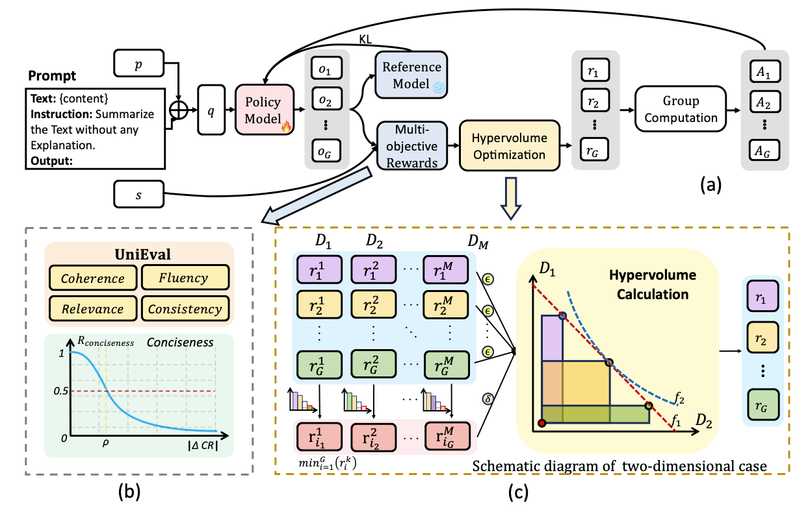

# HVO: Hypervolume Optimization for Multi-Objective Text Summarization based on GRPO

## 📚 Overview
Text summarization is a crucial task that requires the simultaneous optimization of multiple objectives, including consistency, coherence, relevance, and fluency, which presents considerable challenges. Although large language models (LLMs) have demonstrated remarkable performance, enhanced by reinforcement learning (RL), few studies have focused on optimizing the multi-objective problem of summarization through RL based on LLMs. In this paper, we introduce hypervolume optimization (HVO), a novel optimization strategy that dynamically adjusts the scores between groups during the reward process in RL by using the hypervolume method. This method guides the model’s optimization to progressively approximate the pareto front, thereby generating balanced summaries across multiple objectives.

## 🔑 Key Features
- **Multi-Objective RL**: Balances multiple reward signals during model training to ensure high-quality summaries.
- **Hypervolume Maximization**: Utilizes the hypervolume metric to guide the model’s optimization toward the Pareto optimal frontier.
- **Enhanced Stability**: Incorporates a length constraint mechanism to address summary length collapse during training.

## 👋🏻 Method Overview
The hypervolume method is an evaluation metric in multi-objective optimization that measures the volume of the hypercube occupied by a set of solutions in the objective space. As shown in Figure 2 (c), taking the two-dimensional case as an example, when the weighted linear combination scores of the samples are similar, samples with more balanced dimensions have higher hypervolume values. Moreover, hypervolume-based evaluation has been shown to be a Pareto-consistent evaluation method. we integrate hypervolume evaluation into the multi-dimensional rewards of GRPO and use the commonly adopted approach of selecting a slightly worse reference point than the nadir point. 


The entire process of HVO. In subplot (c), the points on the $f_1$ line represent the same linear weighted sum score for $D_1$ and $D_2$, while the points on the $f_2$ line represent the same hypervolume value for $D_1$ and $D_2$.
## 🏃‍♂️‍➡️ Quick Start
### 📊 Requirements
- Python 3.10
- PyTorch 
- UniEval for multi-dimensional evaluation
- Pre-trained language models (e.g., Qwen 2.5)

## 🐹 Setup and Installation

Clone the repository:
```bash
git clone https://github.com/ai4business-LiAuto/HVO.git
cd HVO
```
Install required dependencies:

```bash
pip install -r requirements.txt
```

Usage
```
sh run.sh
```

## Checkpoint
huggingface: hvo4ts/cnn-dailymail

## 🙏 Acknowledgement
Special thanks to the following repositories for their invaluable code
Our trainer is partially adapted from [trl](https://github.com/huggingface/trl),and evaluator is from
[UniEval](https://github.com/maszhongming/UniEval)
